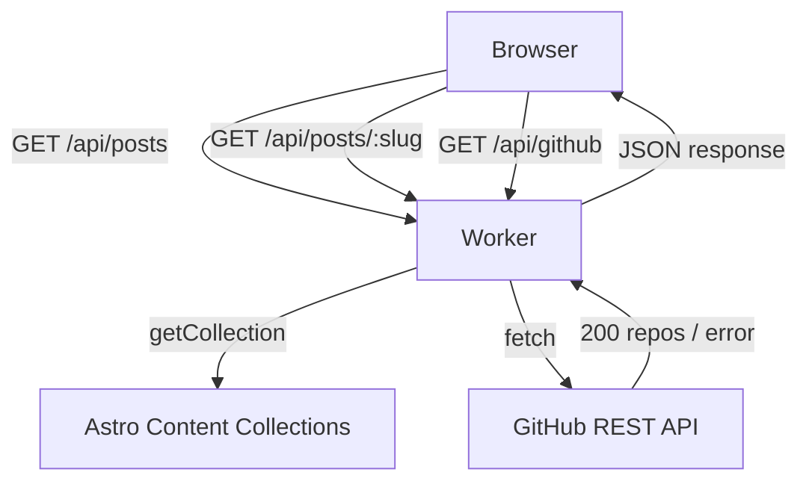

# High-Level Design — Extension 2: API & Integration

## Components Added

| Component | File | Responsibility |
|---|---|---|
| GitHub API endpoint | `src/pages/api/github.ts` | Fetches public repos from GitHub API, caches response, returns filtered JSON |
| Posts list endpoint | `src/pages/api/posts.ts` | Returns all blog posts as JSON from Astro content collections |
| Post by slug endpoint | `src/pages/api/posts/[slug].ts` | Returns a single blog post by slug, 404 if not found |
| OpenAPI spec | `openapi.yaml` | Documents all API contracts |

## Component Diagram

## Data Stores & External Services

| Store / Service | Used For |
|---|---|
| Astro Content Collections | Source of blog post data |
| GitHub REST API | Live repository data for projects page |
| Cloudflare Cache-Control | Caches GitHub response for 5 minutes at the edge |

## Failure Handling

If GitHub API is down or slow, `/api/github` returns `{ ok: false, repos: [], error: "..." }` with status 503. The projects page renders with an empty repo list and a friendly message instead of crashing.