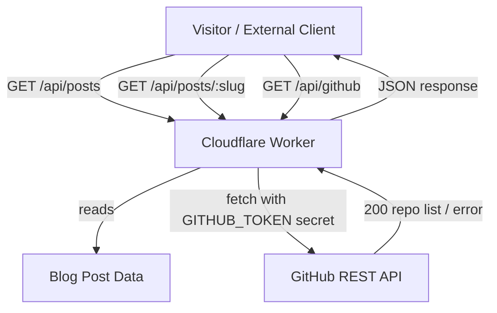
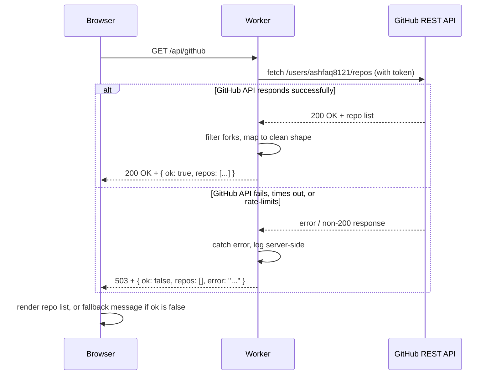
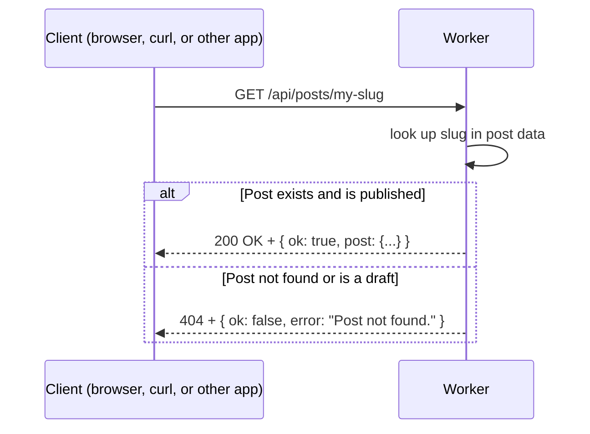

# HLD.md — Extension 2: API & Integration

## Where This Fits

Extension 1 built the backend (contact form, D1 storage, admin dashboard). Extension 2 exposes
that data — and external data — through clean, documented JSON APIs that anyone (a person,
script, or AI agent) can call without guessing how the system works.

## Components Added

| Component | File | Responsibility |
|---|---|---|
| GitHub repos API | `src/pages/api/github.ts` | Calls the GitHub REST API for public repos, filters out forks, caches the response, returns a clean JSON shape |
| Blog posts list API | `src/pages/api/posts.ts` | Returns all published blog posts as JSON |
| Blog post by slug API | `src/pages/api/posts/[slug].ts` | Returns one blog post's full content by slug, or a 404 if it doesn't exist |
| OpenAPI spec | `openapi.yaml` | Documents the contract for all three endpoints — request shape, response shape, status codes |

## Component Diagram

## Data Stores & External Services

| Store / Service | Used For |
|---|---|
| Blog post data (in-repo) | Source of truth for `/api/posts` and `/api/posts/:slug` |
| GitHub REST API | Live repository data, fetched fresh on each request (subject to edge caching) |
| Cloudflare Cache-Control header | Caches the GitHub response for 5 minutes at the edge to reduce external calls |
| Wrangler secret (`GITHUB_TOKEN`) | Authenticates the GitHub API call without ever touching the repo or client code |

## Sequence Diagram — GET /api/github (external integration + fallback)

## Sequence Diagram — GET /api/posts/:slug

## Failure Handling Summary

If the GitHub API is slow or down, the page does not break — `/api/github` degrades to an empty
repo list with a clear error message and a `503` status, rather than throwing an unhandled
exception. Blog post lookups treat a missing slug as a normal, expected `404` rather than an
error condition, since "this post doesn't exist" is a valid outcome of a lookup.
